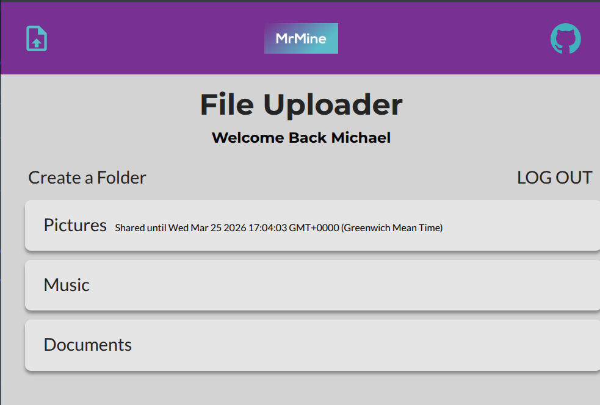

# File Uploader

A file management system app from The Odin Project in the Node section.

By building from scratch, this will help solidify my recent learning of Prisma ORM with PostgreSQL and backend authentication server-side website rending.

A file management system featuring directories, cloud storage, and relational database integration. Built with Node and JavaScript, this backend project handles authentication, cloud storage API interactions, and database operations through prisma.

The app and database is hosted on railway. Live Link: https://mrmine-file-uploader.up.railway.app/



---

## Highlights

- **Authentication**: A session-based authentication flow using Passport.js and express-session, with persistent storage in PostgreSQL via Prisma.
- **Cloud-Based File Handling**: Integrated Supabase API for file uploads, reducing server-side processing.
- **Relational Logic**: Users, Files, and Folder modeled with relational schemas.

---

## Tech Stack

| Layer    | Technologies                           |
| -------- | -------------------------------------- |
| Frontend | JavaScript, ejs, Native CSS            |
| Backend  | Node, Express, JavaScript, Passport.js |
| Database | PostgreSQL, Prisma ORM                 |
| Storage  | Supabase API                           |

---

## System Architecture

The application uses Model View Controller (MVC) design pattern for clear separation of concerns.

---

## Database Schema

```prisma
model User {
  id        Int      @id @default(autoincrement())
  firstName String
  lastName  String
  username  String   @unique
  password  String
  folders   Folder[]
}

model Folder {
  id            Int    @id @default(autoincrement())
  cuid          String @default(cuid(2))
  name          String
  user          User   @relation(fields: [userId], references: [id])
  userId        Int
  files         File[]
  sharedExpire  DateTime?
}

model File {
  id          Int    @id @default(autoincrement())
  cuid        String @default(cuid(2))
  name        String
  size        Int
  uploadedAt  DateTime @default(now())
  url         String @unique
  folder      Folder @relation(fields: [folderId], references: [id])
  folderId    Int
}
```

---

## Local Development

### Prerequisites

- Node.js v18+
- PostgreSQL instance
- Supabase API keys

### Setup

**1. Clone & Install:**

```bash
git clone https://github.com/Mikael92002/file_uploader.git

npm install
```

**2. Environment Setup:**

Create a `.env` in root with your `DATABASE_URL` and Supabase credentials.

**3. Initialize and View Database:**

```bash
npx prisma migrate dev
npx prisma generate
npx prisma studio
```

**4. Run:**

```bash
node --watch app.js
```
